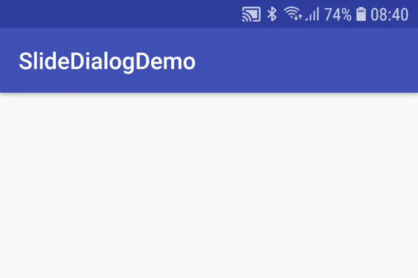

# Slide Dialog

A simple slide dialog aligned on top of app bar.

## Getting Started

Project contains library and a demo app.

## Adding dependency

```groovy
repositories {
    jcenter()
}

dependencies {
    implementation 'com.dawnlight:slidedialog:1.0@aar'
}
```

## Usage



```
SlideDialog.newInstance(this)
                    .message("Alert Message")
                    .show();
```


## Authors

* **devzeze** -[GitHub](https://github.com/devzeze)

## License

This project is licensed under the MIT License - see the [LICENSE.md](LICENSE.md) file for details

